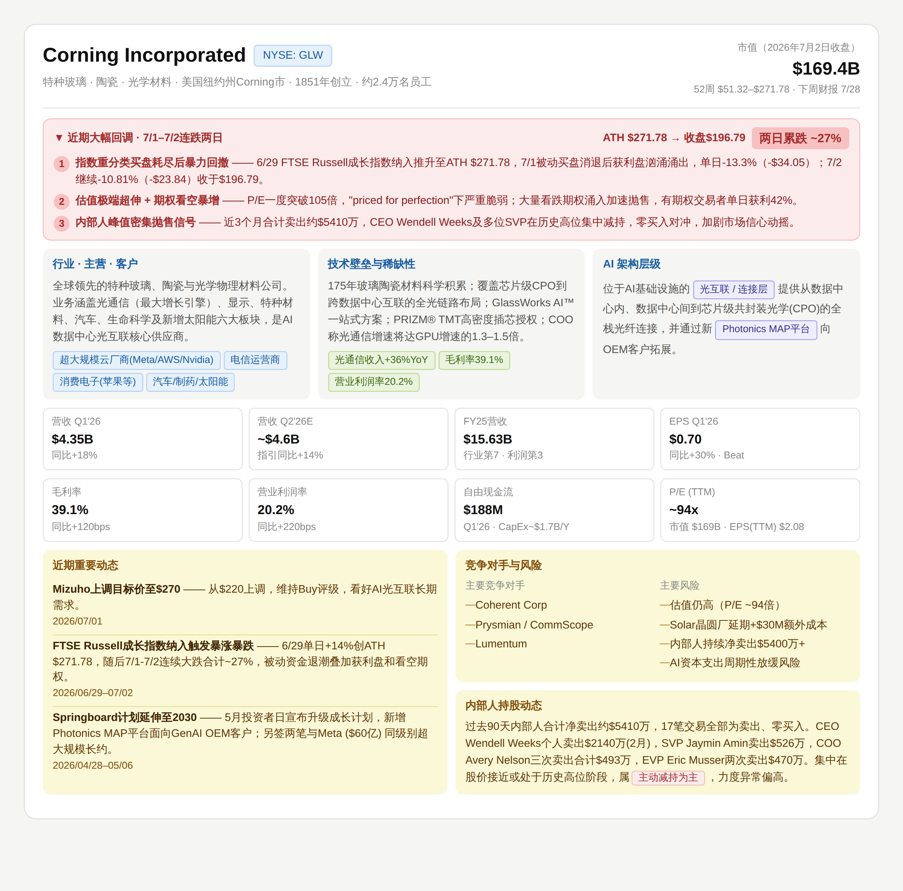

# Quick-Research-Card

A custom Claude Skill that generates a structured equity research flashcard (PNG) from a single command. Type `QRC [ticker]` and Claude will search, compile, render, and export a visual one-pager covering price catalysts, business overview, moat, AI stack positioning, financials, news, competitors, risks, and insider activity.

---

## Sample Output

> QRC card for Corning (GLW), generated July 4, 2026.



---

## How It Works

```
User: QRC NVDA

Claude:  1. Web-searches 4 dimensions in parallel
         2. Assembles data into a color-coded HTML template
         3. Renders to high-DPI PNG via Playwright
         4. Delivers the downloadable image
```

### Step 1 — Parallel Web Search

Four searches run with concise 1–6 word queries:

| # | Dimension | Query Template |
|---|-----------|---------------|
| 1 | Price catalyst | `[TICKER] stock news today [year]` |
| 2 | Business fundamentals | `[Company] business overview technology AI [year]` |
| 3 | Financials | `[TICKER] revenue EPS earnings quarterly [year]` |
| 4 | Insider activity | `[TICKER] insider trading buying selling SEC [year]` |

If the user provides context (e.g. `QRC NVDA up 15% today`), the first search narrows to that direction.

### Step 2 — HTML Flashcard Rendering

Data is assembled into a single-file HTML template with the following sections:

| Section | Content |
|---------|---------|
| **Header** | Full company name, ticker badge, industry / HQ / founded / headcount, market cap, 52-week range |
| **Price Catalyst** | Date, price range, % change, 1–3 numbered catalysts with explanations |
| **Industry / Business / Customers** | One-line business model + customer-type tags |
| **Technology Moat & Scarcity** | Core moat description + 2–4 validated metric tags (green) |
| **AI Stack Position** | Company's position in the AI infrastructure chain (purple tags) |
| **Financial Metrics (2×4 grid)** | Last 3 quarters revenue + EPS, gross margin, operating margin, cash/FCF, P/E |
| **Recent Developments** | 2–3 news items with bold title + one-line summary + date |
| **Competitors & Risks** | Left column: 2–4 competitors / Right column: 3–4 key risks |
| **Insider Activity** | Summary distinguishing voluntary sales vs. RSU tax-related dispositions |

### Color Scheme

The catalyst box color changes dynamically based on the stock's direction:

| Condition | Background | Border | Title Color |
|-----------|-----------|--------|-------------|
| **Bullish** (stock up) | `#EAF3DE` | `#C0DD97` | `#27500A` |
| **Bearish** (stock down) | `#FCEBEB` | `#F7C1C1` | `#A32D2D` |
| Mid-section (business / tech / AI) | `#f5f5f3` | — | `#185FA5` |
| Bottom section (news / risk / insider) | `#faf8d7` | — | `#854F0B` |

### Tag Palette

- **Green** — Validated metrics (e.g. `Optical Revenue +36% YoY`)
- **Blue** — Customer types, ticker badge
- **Purple** — AI stack position (e.g. `Optical Interconnect Layer`, `Chip Testing Layer`)
- **Red** — Risk flags (e.g. `Active insider selling`)

### Step 3 — PNG Export

Playwright renders the HTML at `device_scale_factor=3` for crisp, high-DPI output:

```python
from playwright.sync_api import sync_playwright

with sync_playwright() as p:
    browser = p.chromium.launch()
    page = browser.new_page(
        viewport={"width": 908, "height": 1200},
        device_scale_factor=3
    )
    page.goto("file:///home/claude/[TICKER]_flashcard.html")
    page.wait_for_timeout(500)
    height = page.evaluate("document.body.scrollHeight")
    page.set_viewport_size({"width": 908, "height": height + 48})
    page.screenshot(path="[TICKER]_QRC.png", full_page=True)
    browser.close()
```

Output filename: `[TICKER]_QRC.png`

### Step 4 — Delivery

Claude presents the PNG for download and adds a 1–3 sentence summary of the key catalyst, without repeating what's already on the card.

---

## Design Decisions

- **Language**: Card body is in Chinese; financial terms stay in English (EPS, P/E, ROIC, BEOL, etc.)
- **Company name**: Always the full legal name in the header (e.g. "Lightwave Logic Inc.", not "LWLG")
- **Date**: The catalyst section always shows the real date, never placeholder text
- **Data freshness**: Financials prioritize the most recent quarterly report, labeled by quarter (e.g. `Q1'26`)
- **Insider sales**: Explicitly distinguishes RSU tax-driven sales (neutral) vs. voluntary open-market sales (flagged)
- **No catalyst found**: If no clear daily catalyst exists, the section title changes to "Recent Price Context" and describes the recent trend
- **Missing data**: Any cell with unavailable data is marked accordingly — never fabricated

---

## Trigger Examples

```
QRC NVDA
QRC Palantir
QRC LWLG
QRC GLW down 13% today
```

---

## Requirements

This skill is designed for **Claude.ai** with web search and computer use (code execution) enabled. It requires:

- Web search access (for real-time data)
- Python + Playwright (pre-installed in Claude's environment)
- File creation and `present_files` capability

---

## License

Personal research tool. Not investment advice.
